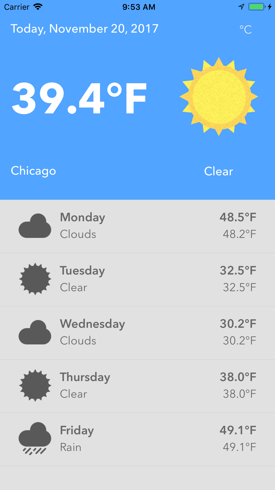
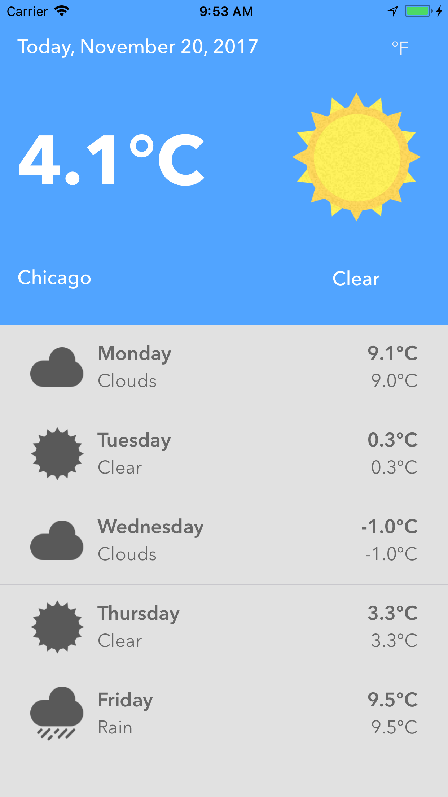

# DevSlopesProj-RainyShine
Very simple weather app for iOS with 5-day forecast

Made for the iOS 11 development course from DevSlopes. Added the feature to switch between C and F by pressing on the opposite symbol on the top right corner. The weather icons were provided by Caleb Stultz. This app uses location data as the only way to get the weather.

The weather data was provided from the [OpenWeatherMap API](https://openweathermap.org/api). If you want to test this app, please register with OpenWeatherMap and use your own API key, not mine. You can change the API key in `Rainy Shine/Utilities/WeatherUtility.swift` and go to Line 18.

The project requires certain Cocoapod libraries, see the Podfile for more information.

